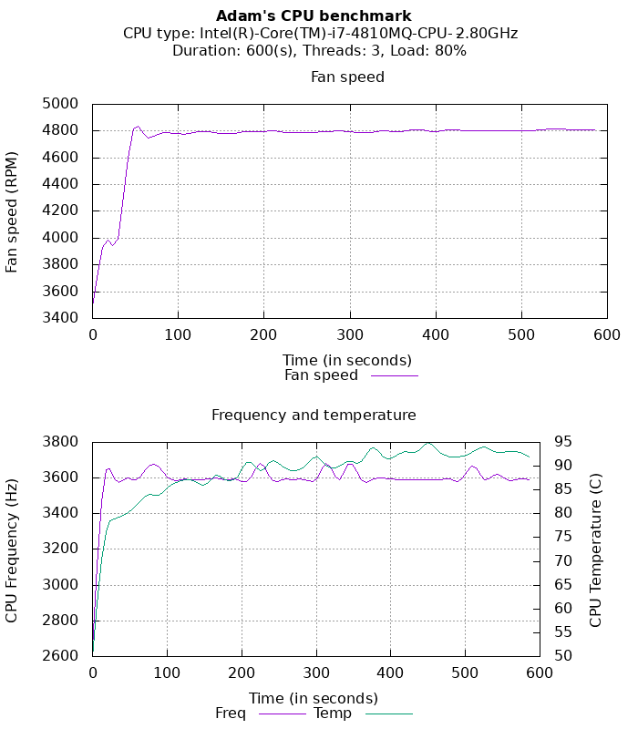

# Introduction

Adam's CPU Benchmark is a simple tool for executing load test on your CPU on a Linux box. 
You can adjust the extent of the load and also the number of threads (cores) to use during the test. 
The app will record the CPU speed, temperature and fan speed changes in time. The result is a multiplot graph. 
Adam's CPU Benchmark is based on the **[stress-ng](https://wiki.ubuntu.com/Kernel/Reference/stress-ng)** 

# Install dependencies
You require three additional software to be installed on your machine before running the test:
* lm_sensors: [https://github.com/lm-sensors/lm-sensors](https://github.com/lm-sensors/lm-sensors)
* stress-ng: [https://github.com/ColinIanKing/stress-ng](https://github.com/ColinIanKing/stress-ng)
* Gnuplot: [http://www.gnuplot.info/](http://www.gnuplot.info/)

### lm_sensors

Install the sensor: 

    $ sudo dnf install lm_sensors

Configure sensor: 

    $ sudo sensors-detect

Start the sensor: 

    $ sensors

### stress-ng

    $ sudo dnf install stress-ng

### Gnuplot

    $ sudo dnf install gnuplot

# How to use

### Parameters:
| Name |description  |
|--|--|
|--help |Display the help message.|
| --duration | Duration of the test (in seconds). Default is 600s |
|--cpu |Number of CPU threads to use. Default 3. |
|--load|CPU load. Default 80%. Don't use 100% for an extended period |

> **_WARNING:_** Don't use 100% for an extended period. It can overheat and damage your system. Use the tester on your own risk!  

### Display the help message

    $ sudo ./runCpuTest.sh --help

### Run the the test

    $ sudo ./runCpuTest.sh --duration 40 --cpu 3 --load 80

The result of the test is the output.png generated into the same directory. 

